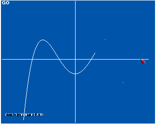

My [AmigaBASIC](https://en.wikipedia.org/wiki/Amiga_Basic) library for the [Amiga 500](https://en.wikipedia.org/wiki/Amiga_500). It contains a collection of miscellaneous small endeavours. Some of them are highlighted further [below](#highlights).

My larger AmigaBASIC projects have their own repositories, see:
* [Tennis Manager](https://github.com/phoyh/tennis-manager)
* [Chinese Input Method Quiz](https://github.com/phoyh/quiz-hanzi-input)
* [France Département Quiz](https://github.com/phoyh/quiz-france-dept)

# How to Use
Put the repository into a mounted directory of an *emulated A500* and run the start script (assuming that AmigaBASIC is installed in mounted `Basic`):
```
execute AmigaBASIC
```

You can also start using the workbench (`info`-files provided).

Some programs make use of my [Assembly](https://en.wikipedia.org/wiki/Assembly_language) subroutines. Their sources are found [here](https://github.com/phoyh/misc-asm-68k-amiga-ocs).

The `diskfont.library` is the only [OS](https://en.wikipedia.org/wiki/Operating_system) routine for which relative paths do not work. Hence, it is put into the `src` folder.

# Highlights

## Concentration

An early [platformer](https://en.wikipedia.org/wiki/Platformer)-like game that test the player's dexterity (and his concentration, of course). Nine levels of increasing difficulty are provided.
|  |  |
| :--: | :--: |

## Modding Sid Meier's Pirates!

Have you ever dreamt of creating a [mod](https://en.wikipedia.org/wiki/Video_game_modding) on the original Amiga version of [Sid Meier's Pirates!](https://en.wikipedia.org/wiki/Sid_Meier%27s_Pirates!) on the Amiga? With `PiratesModCreateFork`, a new mod is forked from the main game (original disk required and not part of this repository). This includes replacing the map (example for the Indian Ocean is `data/PiratesMod/IndianOcean`), replacing countries (e.g., Portugal instead of Spain) and resources (e.g., pepper instead of spices). `PiratesModMapShow` draws the mod map and `PiratesModCities` provides a means of editing the cities, including all their properties. Finally, `PiratesModSplitter` extracts only the relevant mod parts from the `rez` files (about *10%* of the size). They are provided in `data/PiratesMod/*Pirates.rez.section`.
* As a side note, the game is very finicky about the mods it is able to run and may crash at the beginning if the mod goes too far. It is advisable to steadily refine and test the mod to be sure it is runnable.

|  |  |
| :--: | :--: |
| Mesoamerican map from the original game. | Mod map for the Indian Ocean. <br> The major rivers are even navigatable. |

|  |
| :--: |
| List of cities for the Indian Ocean mod. |

|  |  |
| :--: | :--: |
| Available options in the cities editor. | Welcome to the Indian Ocean. |

## Modding TV Sports Basketball

`TVSportsRoster`: Reads and displays the roster file `tdat` from the [TV Sports Basketball](https://en.wikipedia.org/wiki/TV_Sports:_Basketball) disk or from the self-made *1993-4* [NBA](https://en.wikipedia.org/wiki/National_Basketball_Association) roster included in `data/TVSports/tdat`. The properties *shirt number* and *height* are read-only in the game. They can be edited by `TVSportsEditorNumber` and `TVSportsEditorHeight`.
|  |
| :--: |
| The [Golden State Warriors](https://en.wikipedia.org/wiki/Golden_State_Warriors) in *1993-4*.|

`TVSportsStatsEvaluator`: Reads in the season statistics `seasonstats.prt` from the [TV Sports Basketball](https://en.wikipedia.org/wiki/TV_Sports:_Basketball) disk, asks for the number of games played in this season (not available in the file) and calculates one aggregate "worth" value for each player, which is $$_{FGM*1.4-.8*FGA+TPM*2.5-.8*TPA+FTM-.8*FTA+.6*REB+ASS+1.2*BLK+1.4*STL-1.4*TRO-.3*FLS}$$
|  |
| :--: |

# Mathmatics

`BinomialDistributionGauss`: [Binomial distribution](https://en.wikipedia.org/wiki/Binomial_distribution) for $n=200$ and $p=.5$ which clearly approximates the [normal distribution](https://en.wikipedia.org/wiki/Normal_distribution).
|  |
| :--: |

`PerspectivePolyhedron` performs linear mappings to draw an [Octahedron](https://en.wikipedia.org/wiki/Octahedron) and a [Cuboid](https://en.wikipedia.org/wiki/Cuboid) from an angle. `CartesianProjection` starts from the [Cartesian coordinate system](https://en.wikipedia.org/wiki/Cartesian_coordinate_system) and draws octahedron points in perspective.
|  |  |
| :--: | :--: |

`PolynomialInterpolation`: Performs [polynomial interpolation](https://en.wikipedia.org/wiki/Polynomial_interpolation) of an arbitrary set of points that indicated by the mouse at the start.
|  |
| :--: |

`PyramidWalker`: Performs linear mappings to repeatedly draw a pyramid while you change the perspective using the numpad and the arrow-up/down keys.
|  |
| :--: |

# Physics

`Boomerang`: Physical engine to simulate the movement of a [boomerang](https://en.wikipedia.org/wiki/Boomerang) without friction losses.
|  |
| :--: |

`Dopplerschaukel`: Physical engine to simulate the movement of a [swing](https://en.wikipedia.org/wiki/Swing_(seat)) which emits a sinus sound at *1000 hertz*. This sound undergoes the [Doppler effect](https://en.wikipedia.org/wiki/Doppler_effect) and is voiced as if it was heard at the swing's rest position.
|  |
| :--: |

`Electrostatics`: Physical engine to simulate the movement of an electron in a field of one big and one small negatively loaded ball. Demonstrates that, in [electrostatics](https://en.wikipedia.org/wiki/Electrostatics), repulsion is possible whereas in gravity it is not.
|  |
| :--: |

`SpaceShipOrbit`: Choose initial velocity, the planet's mass and your initial position. The physical engine to simulate the movement of your spaceship under the effect of [gravity](https://en.wikipedia.org/wiki/Gravity).
|  |
| :--: |

`WienFilter`: Point will only move through the field to the right for exactly the provided velocity of *10,000* ([Wien filter](https://en.wikipedia.org/wiki/Wien_filter)).

# Computer Science

`ChineseRemainder`: Efficient calculation of the [Chinese remainder problem](https://en.wikipedia.org/wiki/Chinese_remainder_theorem) for arbitrary input.
|  |
| :--: |

`KnuthMorrisPratt`: Search for substrings in linear time by using [Knuth-Morris-Pratt's algorithm](https://en.wikipedia.org/wiki/Knuth%E2%80%93Morris%E2%80%93Pratt_algorithm).
|  |
| :--: |

# Miscellaneous

`DiskSwapPrompt`: [Demo](https://en.wikipedia.org/wiki/Amiga_demos) for asking the user to change to [floppy disk](https://en.wikipedia.org/wiki/Floppy_disk) 2. Uses copper list in order to obtain scrolling color gradients.
|  |
| :--: |

`FontLoader`: Shell for setting window [fonts](https://en.wikipedia.org/wiki/Font).
|  |
| :--: |

`Iff2BitmapConverter`: Converts [IFF](https://en.wikipedia.org/wiki/Interchange_File_Format) images to [bitmap](https://en.wikipedia.org/wiki/Bitmap) files. They can also be shown. Furthermore, [Defender of the Crown](https://en.wikipedia.org/wiki/Defender_of_the_Crown)'s IFF images can also be extracted if the original game disk is provided. This is mostly the functionality of the special purpose `Defender2BitmapConverter`.
|  |
| :--: |

`IntervalQuiz`: Plays between *2* and *4* notes and you need to find their intervals.
|  |  |
| :--: | :--: |
| The available quiz options. <br> Intervals beyond the octave <br> only occur on *difficult*. | Bad answers are corrected. <br> The intervals from the bottom-most to <br> the other notes are to be found.

`VideoTapeManager`: Knows which video tape holds which film. In addition, film metadata like languages and country is also stored. Based on that, several search methods are provided.
|  |  |
| :--: | :--: |
